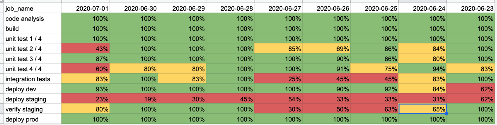

# README

Gives you data to help fix persistently flaky pipeline jobs. Calculates historical CI/CD master-branch pipeline reliability using the [Gitlab API](https://docs.gitlab.com/ee/api/README.html).

## How to run

Retrieve your gitlab host, ie. gitlab.example.com.

Retrieve your project (repo) id, ie. 124.

Retrieve your personal gitlab access token with api-rights. Instructions [here](https://docs.gitlab.com/ee/user/profile/personal_access_tokens.html).

Determine how many 100-page pipelines you want, ie. 10 (1,000 most-recent master-branch pipelines).

```
$ bundle install
$ bundle exec rails db:create db:migrate
$ bin/rake "ingest_job_runs[YOUR-GITLAB-HOST, YOUR-GITLAB-ACCESS-TOKEN-HERE, YOUR_PROJECT_ID, PAGE_MAX]"
$ bin/rake "output_metrics_csv[]"
```

### Sample output

The rake task outputs a csv file.



### Models

```
> Job.find_by(name: 'deploy_development')
=> #<Job id: 12, name: "deploy_development">

> Job.find_by(name: 'deploy_development').job_run.count
=> 350

# todays jobs
> Job.find_by(name: 'deploy_development').job_run.select{ |job_run| job_run.finished_at > Time.current.beginning_of_day }.count
=> 2

irb(main):050:0> Job.find_by(name: 'deploy_development').job_run.select{ |job_run| job_run.finished_at > Time.current.beginning_of_day }.pluck(:resource_id, :status)
=> [["331281", "failed"], ["721123", "failed"]]

# view job logs at https://<your-gitlab-host>/<folder>/<repo>/-/jobs/721123
```

### Sample logs

```
ingesting pipelines page 1
ingesting jobs from pipeline 125
ingesting jobs from pipeline 126
ingesting jobs from pipeline 127
ingesting jobs from pipeline 128
ingesting jobs from pipeline 129
ingesting jobs from pipeline 130
ingesting jobs from pipeline 131
...
ingesting pipelines page 2
ingesting jobs from pipeline 132
ingesting jobs from pipeline 133
...
ingesting pipelines page 275
ingesting jobs from pipeline 240
ingesting jobs from pipeline 241
...
jobs ingested successfully in 5400 secs

calculating job statistics
there are a total of 75000 job_runs
computed stats for 0 job_runs
computed stats for 1000 job_runs
...
computed stats for 75000 job_runs
done calculating job statistics

outputting stats for job: build
outputting stats for job: build image
outputting stats for job: integration test
outputting stats for job: unit test 3 / 20
...
outputting stats for job: verify_production
pipeline reliability metrics outputted to job_reliability_stats_output.csv
```
